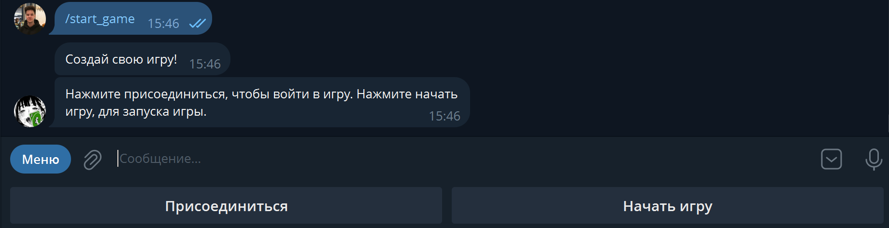
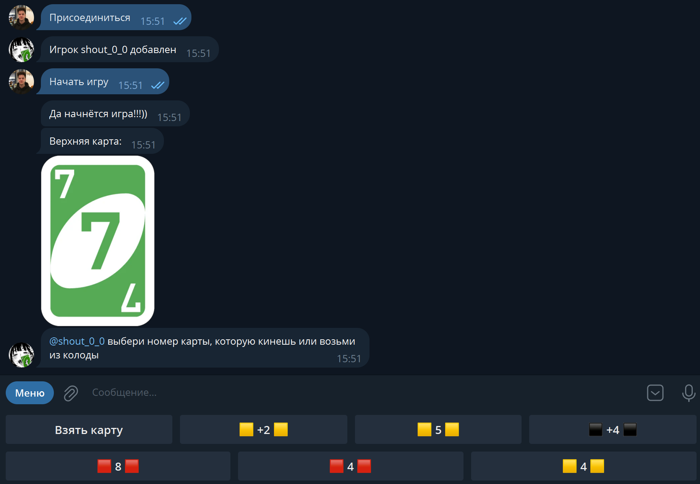

# Telegram-Bot-Uno
Telegram-бот, реализующий карточную игру UNO.

# Возможности:
    Запуск набора лобби для старта игры.
    Запуск нескольких игр параллельно в нескольких чатах.
# Использованные сторонние библиотеки:
    pyTelegramBotApi - для взаимодействия между приложением на Python и telegram
    numpy - для генерации последовательности карт в колоде.
    thread6 - для поддержки запуска игр в нескольких потоках.

# Скриншоты, иллюстрирующие работу бота:

